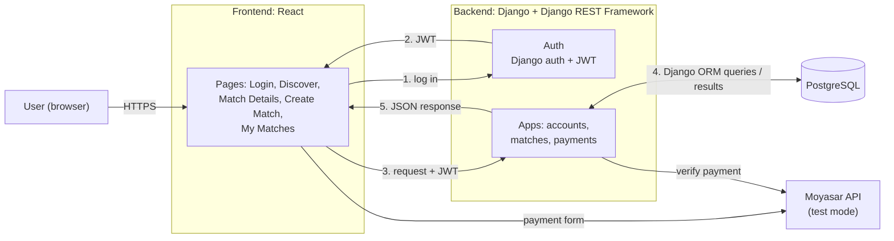
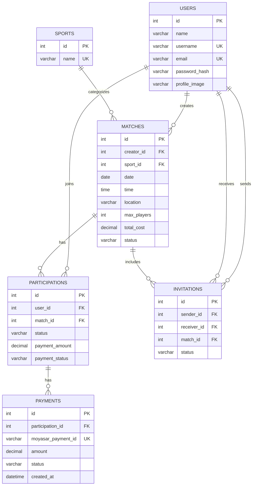
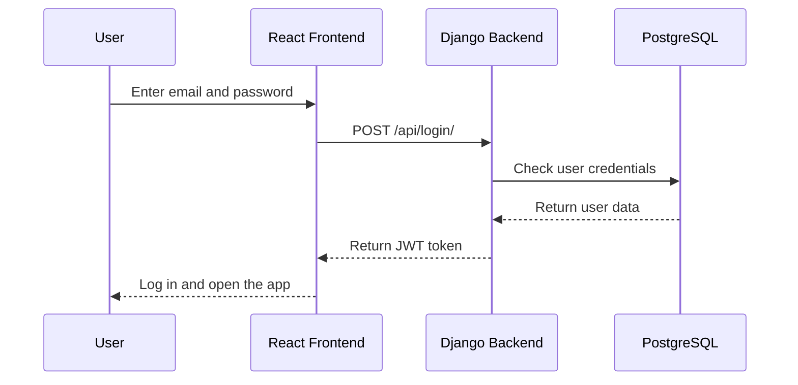
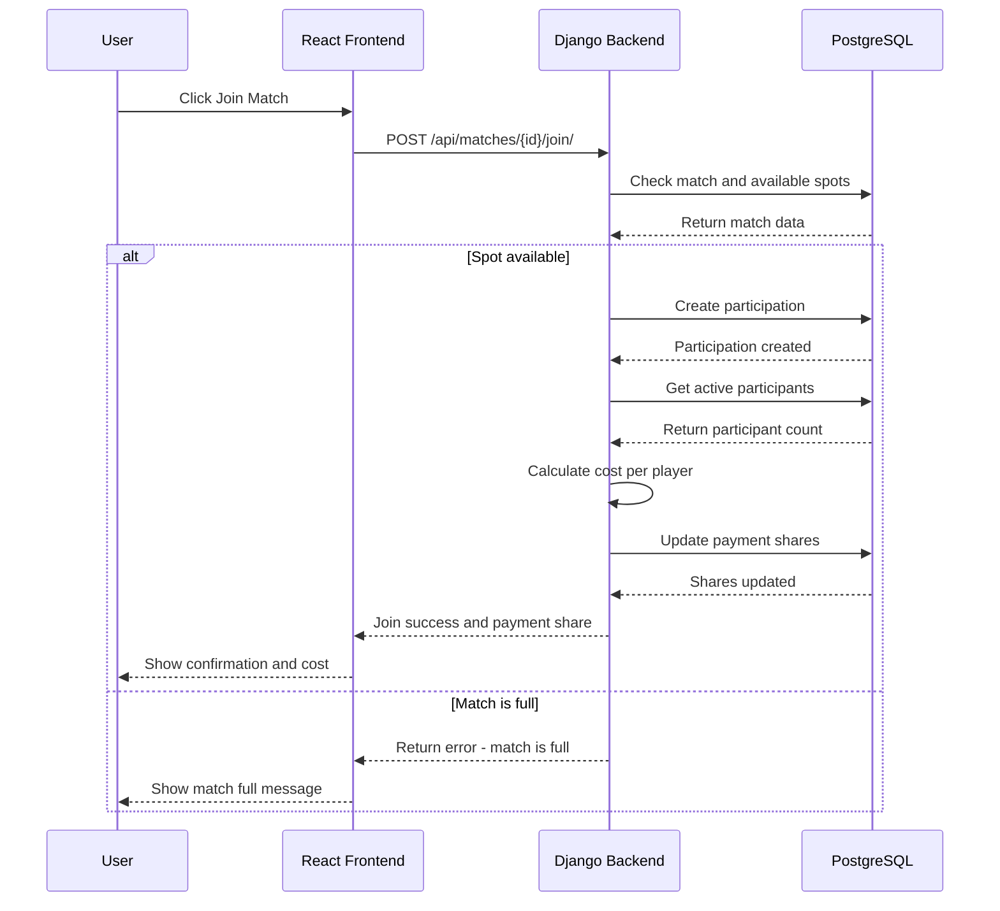
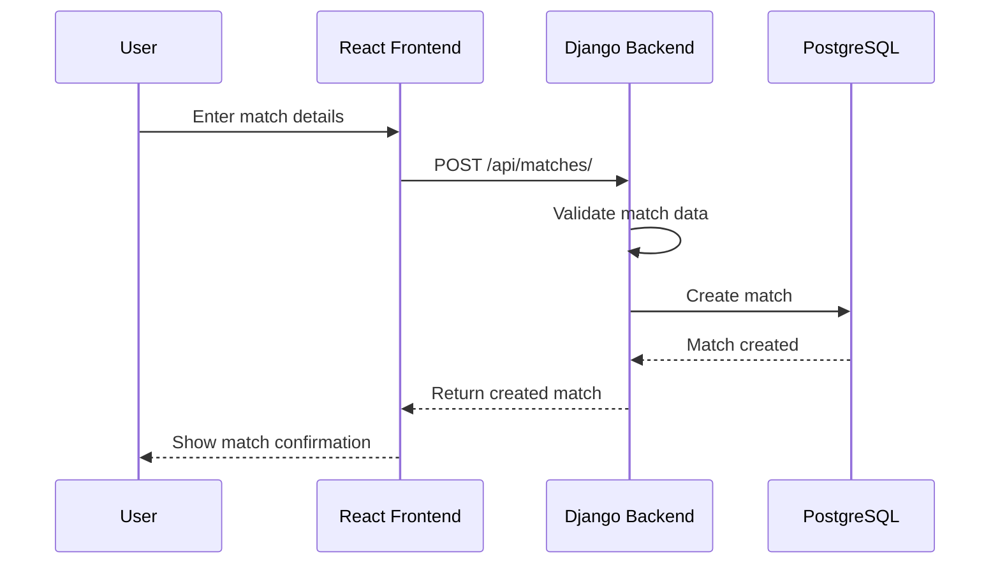
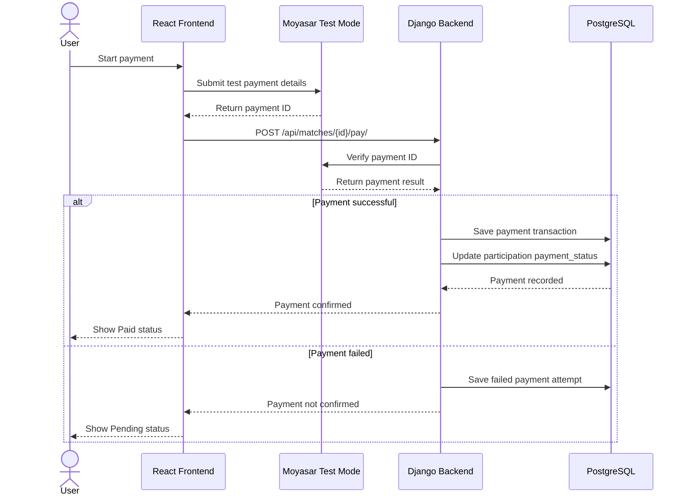

# Stage 3: Technical Documentation

## Contents

- [0. User Stories and Mockups](#0-user-stories-and-mockups)
- [1. System Architecture](#1-system-architecture)
- [2. Define Components, Classes, and Database Design](#2-define-components-classes-and-database-design)
- [3. High-Level Sequence Diagrams](#3-high-level-sequence-diagrams)
- [4. Document External and Internal APIs](#4-document-external-and-internal-apis)
- [5. SCM and QA Strategies](#5-scm-and-qa-strategies)
- [6. Technical Justifications](#6-technical-justifications)
---


## 0. User Stories and Mockups
## moscow framework for prioritization
## Overview
 
| Priority | Stories | Scope |
|----------|:-------:|-------|
| Must Have | 7 | Core MVP, required for launch |
| Should Have | 3 | Important, included if time allows |
| Could Have | 2 | Nice to have |
| Won't Have | 5 | Out of scope for this MVP |
 
---
 
## Must Have
 
| # | Story | As a... | I want to... | So that... |
|:-:|-------|---------|--------------|------------|
| 1 | **Account Creation & Login** | new user | create an account and log in | I can access the platform features |
| 2 | **Browse & Filter Matches** | player | browse available matches and filter them by sport, date, and location | I can find a match that fits my schedule |
| 3 | **View Match Details** | player | see a match's date, time, location, players, and available spots | I can decide whether to join |
| 4 | **Join or Leave a Match** | player | join an available match or leave one I joined | I can play without organizing a game myself |
| 5 | **Create a Match** | match creator | create a match by entering the sport, venue, date, time, and number of players | others can join my game |
| 6 | **Cost Splitting** | match creator | enter the total match cost and have it split automatically among players | each player only pays their fair share |
| 7 | **Payment Status** | player | complete a simulated payment, view my payment share, and see my status (Paid / Pending) | I know my spot is confirmed |
 
## Should Have
 
| # | Story | As a... | I want to... | So that... |
|:-:|-------|---------|--------------|------------|
| 8 | **Invite Players** | match creator | invite players to my match | I can fill spots with people I know |
| 9 | **Manage Match** | match creator | view players, edit match details, or cancel the match | I can handle changes easily |
| 10 | **Track Payments** | match creator | see which players have paid | I don't have to chase people manually |
 
## Could Have
 
| # | Story | As a... | I want to... | So that... |
|:-:|-------|---------|--------------|------------|
| 11 | **Profile Setup** | registered player | add my favorite sports, skill level, and a short bio | other players know my background |
| 12 | **Rankings & Leaderboards** | player | see rankings, leaderboards, and points | I can track my progress and compete with others |
 
## Won't Have (this MVP)
 
- Public challenges
- In-app chat
- AI or personalized recommendations
- Social features (followers, feed)
- Real payment processing (Mada, Apple Pay)
---
 
## Progress Tracker
 
### Must Have
- [ ] #1 Account Creation & Login
- [ ] #2 Browse & Filter Matches
- [ ] #3 View Match Details
- [ ] #4 Join or Leave a Match
- [ ] #5 Create a Match
- [ ] #6 Cost Splitting
- [ ] #7 Payment Status
### Should Have
- [ ] #8 Invite Players
- [ ] #9 Manage Match
- [ ] #10 Track Payments
### Could Have
- [ ] #11 Profile Setup
- [ ] #12 Rankings & Leaderboards
---
### Mockups
we will add the figma link here


## 1. System Architecture

Wesal is a web app with a React frontend, a Django backend and a PostgreSQL database. Payments are simulated through Moyasar's test mode. The diagram below shows how these parts connect and how data moves between them.



### Components

| Part | Tech | What it does |
|------|------|--------------|
| Frontend | React | The pages users see. Sends requests to the backend and shows the results |
| Backend | Django + Django REST Framework | All the logic for accounts, matches, invites, cost splitting and payment status |
| Auth | Django auth + Simple JWT | Sign up and login, gives the user a token for later requests |
| Database | PostgreSQL | Stores users, sports, matches, participations, invitations, and payment transactions |
| Containerization | Docker + Docker Compose | Runs the frontend, backend and database as separate containers with one command (`docker compose up`) |
| External APIs | Moyasar (test mode) | Simulated payments: players pay their share with test cards, and the backend verifies each payment with Moyasar. No maps API; real payments are out of scope (see charter) |

### How data flows

1. The user logs in and the backend sends back a JWT.
2. Every request from the frontend includes that token.
3. Django checks the token before the request reaches any view.
4. The view reads or updates the database through the Django ORM.
5. The backend returns JSON and the page updates.

Example: when a player joins a match, the frontend sends `POST /api/matches/:id/join/`. The backend checks there's a free spot, adds the player, recalculates each player's share of the cost, and returns the updated match.

Payment example: the player pays their share through Moyasar's payment form, which returns a payment ID. The frontend sends that ID to `POST /api/matches/:id/pay/`, and the backend checks it with Moyasar before marking the player as Paid.

### Architecture style

We're using a **monolithic** setup: one Django project split into three apps (accounts, matches, payments) that share one database. For a team of 4 with 6 weeks of development, this is simpler to build, test and deploy than microservices. Keeping the apps separate means we could split them later if Wesal grows.

### Security

- Passwords are hashed by Django's built-in auth. We never store them in plain text.
- Protected endpoints require a valid JWT, while sign up and login remain publicly accessible.
- Only the creator of a match can edit it, cancel it, invite players or see payment tracking.
- All traffic goes over HTTPS.
- Django validates input before saving (for example, max players must be more than 0 and cost can't be negative).
- The Moyasar secret key is stored only on the backend as an environment variable. Card details go straight to Moyasar and never touch our servers.
- We only store the user data we need, following SDAIA data-protection guidance.

### Scalability

- The frontend and backend run separately, so each can be scaled on its own.
- JWT auth means the backend doesn't keep sessions, so more backend instances can be added if traffic grows.
- The database has indexes on the fields we filter by most (sport, date, and location).

### Why these tools

- **Django + DRF:** Our team knows Python, and Django gives us auth, an admin panel and migrations out of the box.
- **React:** Keeps the frontend separate from the backend, so both can be built at the same time.
- **PostgreSQL:** Our data is relational (users, matches and payments all link together) and it works well with Django.
- **Moyasar (test mode):** A Saudi payment gateway that works in SAR, suggested by our mentor. Test mode lets us simulate payments without real money, as agreed in our charter. No maps API; players filter by location.


## 2. Define Components, Classes, and Database Design

### Back-end Classes

Since we are using Django for the back-end, we identified the main classes based on the main features of the application.

| Class | Attributes | Methods |
|---|---|---|
| User | id, name, username, email, password_hash, profile_image | update_profile() |
| Match | id, creator_id, sport_id, date, time, location, max_players, total_cost, status | create_match(), update_match(), cancel_match() |
| Sport | id, name | No specific methods defined yet |
| Participation | id, user_id, match_id, status, payment_amount, payment_status | join_match(), leave_match(), update_payment_status() |
| Payment | id, participation_id, moyasar_payment_id, amount, status, created_at | verify_payment(), update_payment_status() |
| Invitation | id, sender_id, receiver_id, match_id, status | send_invitation(), accept_invitation(), decline_invitation() |

### Front-end Components

Since we are using React for the front-end, we divided the interface into simple reusable components.


| Component | Description |
|---|---|
| Navbar | Used to move between the main pages |
| MatchCard | Shows the main match details |
| MatchList | Displays the available matches |
| MatchFilters | Filters matches by sport, date, and location |
| CreateMatchForm | Allows users to create a new match |
| Profile | Shows the user's basic information and profile image |
| InvitationList | Shows invitations received by the user |
| JoinButton | Allows the user to join a match |
| LeaveButton | Allows the user to leave a match |
| PaymentStatus | Shows the player's payment share and payment status (Paid / Pending) |
| PaymentTracker | Allows the match creator to view and update players' payment statuses |

### Database Design

We are using a relational database for the project. The main tables are Users, Sports, Matches, Participations, and Invitations, and Payments.

#### Users
Stores user account information.

#### Sports
Stores the sports available in the application.

#### Matches
Stores the details of each created match, including the sport, date, time, location, maximum number of players, total cost, and match status.

#### Participations
Connects users with the matches they join and stores each player's participation and payment status.

#### Invitations
Stores match invitations sent between users.

**Payments**

Stores simulated payment transactions processed through Moyasar Test Mode, including the payment ID, amount, status, and creation date. Each payment is linked to a player's participation in a match.


### Relationships

| Entities | Relationship | Description |
|---|---|---|
| User → Match | One-to-Many | One user can create many matches |
| Sport → Match | One-to-Many | One sport can be linked to many matches |
| User ↔ Match | Many-to-Many | Users can join many matches and matches can have many users through Participations |
| User → Participation | One-to-Many | One user can have many participations |
| Match → Participation | One-to-Many | One match can have many participations |
| User → Invitation | One-to-Many | One user can send many invitations |
| Match → Invitation | One-to-Many | One match can have many invitations |
| Participation → Payment | One-to-Many | One participation can have multiple payment attempts, and each payment belongs to one participation |

### ER Diagram




## 3. High-Level Sequence Diagrams

### Login 

This sequence shows how a user logs in and receives a JWT token after successful authentication.





### Join Match

This sequence shows how a player joins an available match and how the system calculates each player's share of the match cost.




### Create Match

This sequence shows how a user creates a new match and how the match data is validated and stored.



### Process Payment

This sequence shows how a player completes a simulated payment using Moyasar Test Mode. The backend verifies the transaction before updating the payment status.




## 4. Document External and Internal APIs

### External APIs

| API | Why we chose it |
|---|---|
| Moyasar (test mode) | Used to simulate payments. Players pay their share with Moyasar's test cards, so no real money is used. We chose it because it is a Saudi payment gateway that works in SAR, and it was suggested by our mentor. |

The frontend shows Moyasar's payment form, and the backend checks the payment with Moyasar (`GET https://api.moyasar.com/v1/payments/{id}`) before marking the player as Paid. The secret key is only stored on the backend.

We are not using a maps API. Players filter matches by location for now.

### Internal API

All endpoints start with `/api/`, use JSON, and need a JWT in the header (`Authorization: Bearer <token>`), except sign up and login.

| Method | URL path | Description | Input | Output |
|---|---|---|---|---|
| POST | `/api/register/` | Create an account | JSON: name, username, email, password | JSON: user |
| POST | `/api/login/` | Log in | JSON: email, password | JSON: JWT token + user |
| GET | `/api/profile/` | View my profile | None | JSON: user |
| PATCH | `/api/profile/` | Update my profile | JSON: name, profile_image | JSON: user |
| GET | `/api/sports/` | List sports | None | JSON: list of sports |
| GET | `/api/matches/` | Browse matches | Query: sport, date, location | JSON: list of matches |
| POST | `/api/matches/` | Create a match | JSON: sport_id, date, time, location, max_players, total_cost | JSON: match |
| GET | `/api/matches/{id}/` | View match details | None | JSON: match with players |
| PATCH | `/api/matches/{id}/` | Edit a match (creator only) | JSON: fields to change | JSON: match |
| POST | `/api/matches/{id}/cancel/` | Cancel a match (creator only) | None | JSON: match |
| POST | `/api/matches/{id}/join/` | Join a match | None | JSON: match |
| POST | `/api/matches/{id}/leave/` | Leave a match | None | JSON: match |
| POST | `/api/matches/{id}/invitations/` | Invite a player (creator only) | JSON: receiver_id | JSON: invitation |
| GET | `/api/invitations/` | View my invitations | None | JSON: list of invitations |
| POST | `/api/invitations/{id}/accept/` | Accept an invitation | None | JSON: invitation |
| POST | `/api/invitations/{id}/decline/` | Decline an invitation | None | JSON: invitation |
| GET | `/api/my-matches/` | View matches I created or joined | None | JSON: list of matches |
| GET | `/api/matches/{id}/payments/` | View players' payment status (creator only) | None | JSON: list of players with share and status |
| PATCH | `/api/matches/{id}/payments/{user_id}/` | Update a player's payment status (creator only) | JSON: payment_status | JSON: player's share and status |
| POST | `/api/matches/{id}/pay/` | Confirm my Moyasar payment | JSON: moyasar_payment_id | JSON: my share and payment status |

### Example Requests and Responses

**Create a match:** `POST /api/matches/`

Request:
```json
{
  "sport_id": 1,
  "date": "2026-11-20",
  "time": "20:00",
  "location": "Al Malqa, Riyadh",
  "max_players": 10,
  "total_cost": 400
}
```

Response (201):
```json
{
  "id": 7,
  "sport": "Football",
  "date": "2026-11-20",
  "time": "20:00",
  "location": "Al Malqa, Riyadh",
  "max_players": 10,
  "players_count": 1,
  "total_cost": 400,
  "status": "open"
}
```

**Join a match:** `POST /api/matches/7/join/`

Response (200):
```json
{
  "id": 7,
  "players_count": 2,
  "spots_left": 8,
  "my_share": 200,
  "payment_status": "pending"
}
```

**Error response** (for example, the match is full):
```json
{
  "error": "This match is full."
}
```

| Status code | Meaning |
|---|---|
| 200 | Success |
| 201 | Created |
| 400 | Invalid input (for example, the match is full) |
| 401 | Not logged in |
| 403 | Not allowed (for example, not the match creator) |
| 404 | Not found |

## 5. SCM and QA Strategy

### 5.1 Source Control Management

**Tool.** Git, hosted on GitHub in a single team repository (`wesal`). 

**Branching strategy.** We use a simplified Git Flow with three levels:

| Branch | Purpose | Who merges into it |
| --- | --- | --- |
| `main` | Always working, deployable code. Only tested, reviewed work. | Only from `develop`, at the end of a milestone |
| `develop` | Integration branch where everyone's work comes together | From feature branches, after review |
| `feature/*` | One branch per task, branched off `develop` | — |

Feature branches are named after what they do: `feature/user-signup`, `feature/match-discovery`, `fix/join-button-crash`. One task, one branch, one pull request. Branches are deleted after merging so the repository stays readable.

**Commits.** Everyone commits at least once per working session, and commits are small and described in the imperative — "add match model", "fix distance filter rounding" — not "update" or "stuff". We prefix with the area where it helps: `api:`, `ui:`, `db:`.

**Pull requests and code review.** No one merges their own work into `develop`. Every pull request needs **one approving review** from another team member before merging. The PR description says what changed, how to test it, and links the task. Reviewers check that the code runs, that it does what the PR claims, that it doesn't break existing features, and that naming and structure match the rest of the project. Reviews are expected within one working day so nobody is blocked; if a review is urgent, the author says so in Discord.

Review pairings: Jouri reviews Hadeel's frontend work, Hadeel reviews Jouri's backend work, and Ahad reviews documentation and checks scope. Reema reviews anything that affects the interface against the design file.

**Branch protection.** `main` and `develop` are protected: no direct pushes, pull request required, one approval required. This is set in GitHub repository settings and is what actually enforces the rules above.

**Conflicts.** Before opening a pull request, the author pulls the latest `develop` into their branch and resolves conflicts locally. We avoid long-lived branches — anything open more than three days gets merged or split.

### 5.2 Quality Assurance

**Testing strategy.** Three layers, in order of how much we rely on them:

| Layer | What it covers | Tool | Who |
| --- | --- | --- | --- |
| Unit tests | Individual backend functions — distance calculation, spot counting, input validation, permission checks | Jest | Jouri, Ahad |
| API / integration tests | Each endpoint: correct response, correct status code, rejects bad input, rejects unauthorised users | Jest + Supertest, with a Postman collection for manual exploration | Jouri, Ahad |
| Manual end-to-end testing | The full user journeys, clicked through by a person on a real device | Test checklist in Notion | All four |

We are deliberately **not** writing automated end-to-end tests (Cypress or Playwright) for the MVP. They take longer to set up than they would save in four weeks, and our critical flows are few enough to test by hand reliably. This is noted as a Phase 2 improvement.

**What gets tested first.** Priority goes to anything involving money-free but trust-critical logic: the venue approval permission (a non-admin must never be able to approve a venue), joining a full match (must fail cleanly), and the match-spot count staying correct when people join and leave.

**Manual test checklist.** Before each merge into `main`, one member who did not write the code walks through: sign up as a new player, complete the profile, find a match by filter, join it, see it in My Games, create a match, have a second account join it, submit a venue as an owner, approve it as an admin, and confirm it appears publicly. Results are recorded in Notion with pass/fail and a screenshot for failures.

**Bug tracking.** Bugs are filed as GitHub Issues with a label of `bug`, a severity (`critical`, `major`, `minor`), steps to reproduce, and expected versus actual behaviour. Critical bugs block the merge; minor ones go on the backlog. 

**Definition of done.** A task is done when the code is merged into `develop`, it has at least one test if it's backend logic, the manual checklist for its flow passes, it matches the Figma design, and the documentation is updated if the API changed.

### 5.3 Deployment Pipeline

Three environments:

| Environment | Branch | Hosting | Purpose |
| --- | --- | --- | --- |
| Local | feature branch | each member's machine | day-to-day development |
| Staging | `develop` | Vercel (frontend) + Render (API), free tier | integration testing, team demos, tutor review |
| Production | `main` | Vercel + Render, separate instance | what real users see |

Both staging and production deploy automatically on push to their branch, which the hosting platforms do out of the box with no CI configuration needed. The database is Supabase, with a separate project for staging so test data never touches real users.

We add one GitHub Action that runs `npm test` on every pull request. If tests fail, the pull request cannot be merged. That is the whole of our continuous integration — it's small, it's achievable in an afternoon, and it catches the most common mistake.

Secrets (database keys, API keys) live in environment variables on the hosting platform and in a local `.env` file that is listed in `.gitignore` and never committed.

## 6. Technical Justifications

Rationales for chosen technologies and designs.

| Part | Tech | Technical Justification |
|------|------|-------------------------|
| Frontend | React | Component-based, so it's easy to reuse screens (match card, invite list, payment status). It has a large ecosystem and community, and it works well with a REST API. |
| Backend | Django + Django REST Framework | Django comes with an ORM, admin panel, validation and built-in security (CSRF, SQL injection protection), which speeds up the MVP. DRF gives ready-made serializers, permissions and viewsets for building the API quickly. |
| Auth | Django auth + Simple JWT | Reuses Django's user model and password hashing instead of building auth from scratch. JWT is stateless, so it suits a React frontend that is separate from the backend. |
| Database | PostgreSQL | A relational database fits the data well (users ↔ matches ↔ participants ↔ payments). It supports transactions and constraints, which keeps cost splitting and payment statuses consistent. It also has first-class support in Django. |
| Containerization | Docker + Docker Compose | Gives every team member the same environment, so there are no "works on my machine" problems. Setup is fast for new members, and the same images can later be deployed to a server. Compose wires the three services together without manual configuration. |
| External APIs | None in the MVP | Keeps the MVP focused and reduces cost, complexity and integration risk. The architecture leaves room to add these APIs later. |

**Overall justification:** the stack is simple, proven and quick to build for an MVP. Each layer has one clear responsibility, and Docker makes the whole system easy to run, test and hand over.
