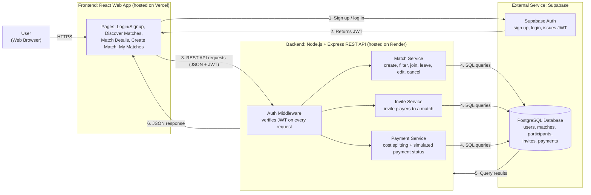

## 0. User Stories and Mockups

### Must Have
1. **Account Creation & Login:** As a new user, I want to create an account and log in, so that I can access the platform features.
2. **Browse & Filter Matches:** As a player, I want to browse available matches and filter them by sport, date, and location, so that I can find a match that fits my schedule.
3. **View Match Details:** As a player, I want to see a match's date, time, location, players, and available spots, so that I can decide whether to join.
4. **Join or Leave a Match:** As a player, I want to join an available match or leave one I joined, so that I can play without organizing a game myself.
5. **Create a Match:** As a match creator, I want to create a match by entering the sport, venue, date, time, and number of players, so that others can join my game.
6. **Cost Splitting:** As a match creator, I want to enter the total match cost and have it split automatically among players, so that each player only pays their fair share.
7. **Payment Status:** As a player, I want to mark my share as paid (simulated payment) and see my status (Paid / Pending), so that I know my spot is confirmed.

### Should Have
8. **Invite Players:** As a match creator, I want to invite players to my match, so that I can fill spots with people I know.
9. **Manage Match:** As a match creator, I want to view players, edit match details, or cancel the match, so that I can handle changes easily.
10. **Track Payments:** As a match creator, I want to see which players have paid, so that I don't have to chase people manually.

### Could Have
11. **Profile Setup:** As a registered player, I want to add my favorite sports, skill level, and a short bio, so that other players know my background.

### Won't Have (this MVP)
- Public challenges
- In-app chat
- AI or personalized recommendations
- Rankings, leaderboards, and points
- Social features (followers, feed)
- Real payment processing (Mada, Apple Pay)

## 1. System Architecture

### Architecture Diagram

### Components

| Component | Technology | Responsibility |
|-----------|-----------|----------------|
| Frontend | React | Displays pages, handles user input, calls the backend API |
| Backend API | Node.js + Express | Business logic: matches, invites, cost splitting, payment status |
| Auth | Supabase Auth | Account creation, login, and issuing JWTs |
| Database | PostgreSQL (Supabase) | Stores users, matches, participants, invites, and payments |
| Hosting | Vercel (frontend), Render (backend) | Free-tier deployment |
| Monitoring | Vercel and Render dashboards | Basic logs and error tracking |

### Data Flow Example: Joining a Match
1. The user logs in through Supabase Auth and receives a JWT.
2. The user filters matches (sport, date, city/district). React sends `GET /api/matches?sport=football&city=riyadh` with the JWT.
3. The Express middleware verifies the JWT, and the Match Service queries PostgreSQL.
4. The user clicks **Join**. React sends `POST /api/matches/:id/join`.
5. The Match Service checks for available spots and adds the player. The Payment Service recalculates each player's share.
6. The backend returns the updated match as JSON, and React updates the page.

### Architecture Style
Wesal uses a **monolithic architecture**: the Match, Invite, and Payment services are modules inside a single Node.js + Express application, sharing one codebase and one PostgreSQL database. We chose this over microservices because it is simpler to build, test, and deploy for a 4-person team in a 6-week MVP.

### Scalability
- The frontend and backend are hosted separately, so each can be scaled on its own.
- The backend is stateless (authentication uses JWTs, not server sessions), so more backend instances can be added later.
- The services are kept as separate modules, so they could be split into independent microservices if the platform grows.

### Security
- **Authentication:** Supabase Auth handles sign-up and login. Every API request must include a valid JWT, checked by the Express middleware.
- **Authorization:** Only a match's creator can edit it, cancel it, or view its payment tracking.
- **Encryption in transit:** All traffic uses HTTPS.
- **Password safety:** Passwords are hashed and stored by Supabase Auth, never by our backend.
- **Input validation:** The backend validates all request data (for example, spots > 0 and cost ≥ 0) before saving it.
- **Data privacy:** Only the minimum user data is stored, in line with SDAIA data-protection guidance.

### Technical Justifications
- **React + Node.js/Express:** Both use JavaScript, so there is one language across the stack. The team already knows it, which fits the 6-week MVP window.
- **PostgreSQL:** The data is relational (users ↔ matches ↔ payments), so SQL relations and constraints fit better than a NoSQL database.
- **Supabase:** Provides hosted PostgreSQL and ready-made authentication on a free tier, which saves building auth from scratch.
- **REST API:** Simple, well understood, and enough for the MVP. Real-time features aren't needed because chat is out of scope.
- **No maps API or payment gateway:** City/district filters and simulated payments keep the MVP within scope, as defined in the charter.
