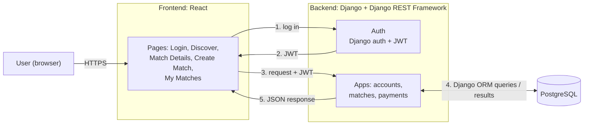
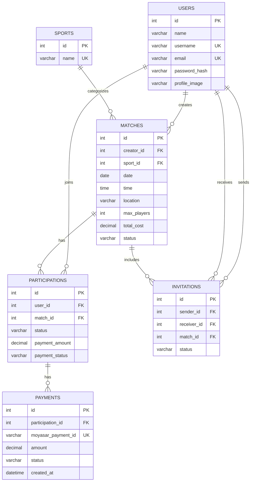
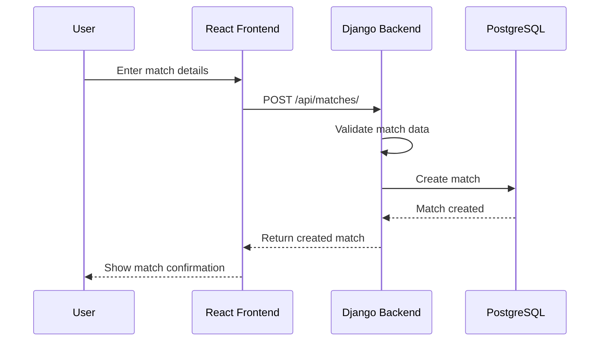
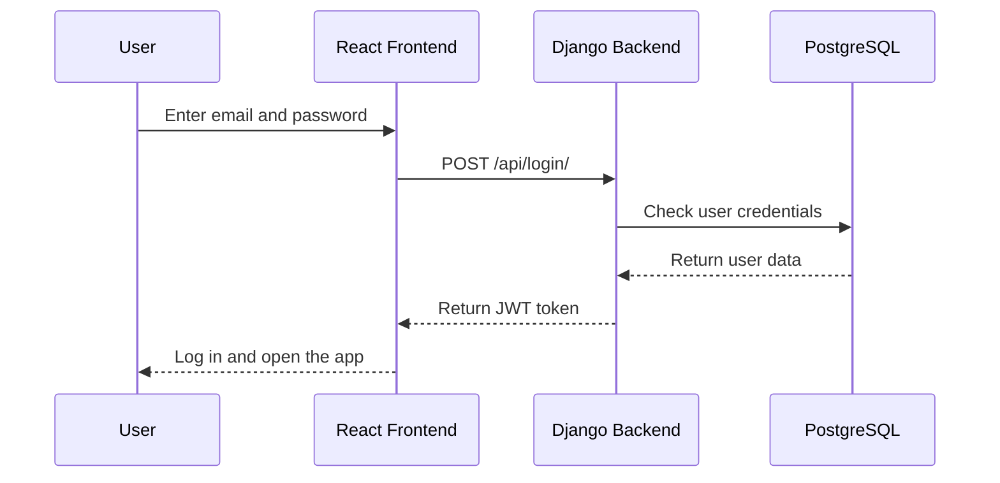

# Stage 3: Technical Documentation

## Contents

- [0. User Stories and Mockups](#0-user-stories-and-mockups)
- [1. System Architecture](#1-system-architecture)
- [2. Define Components, Classes, and Database Design](#2-define-components-classes-and-database-design)
- [3. High-Level Sequence Diagrams](#3-high-level-sequence-diagrams)
- [4. Document External and Internal APIs](#4-document-external-and-internal-apis)
- [5. Plan SCM and QA Strategies](#5-plan-scm-and-qa-strategies)

---


## 0. User Stories and Mockups
## moscow framework for prioritization
### Must Have
1. **Account Creation & Login:** As a new user, I want to create an account and log in, so that I can access the platform features.
2. **Browse & Filter Matches:** As a player, I want to browse available matches and filter them by sport, date, and location, so that I can find a match that fits my schedule.
3. **View Match Details:** As a player, I want to see a match's date, time, location, players, and available spots, so that I can decide whether to join.
4. **Join or Leave a Match:** As a player, I want to join an available match or leave one I joined, so that I can play without organizing a game myself.
5. **Create a Match:** As a match creator, I want to create a match by entering the sport, venue, date, time, and number of players, so that others can join my game.
6. **Cost Splitting:** As a match creator, I want to enter the total match cost and have it split automatically among players, so that each player only pays their fair share.
7. ****Payment Status:** As a player, I want to complete a simulated payment, view my payment share, and see my status (Paid / Pending), so that I know my spot is confirmed.

### Should Have
8. **Invite Players:** As a match creator, I want to invite players to my match, so that I can fill spots with people I know.
9. **Manage Match:** As a match creator, I want to view players, edit match details, or cancel the match, so that I can handle changes easily.
10. **Track Payments:** As a match creator, I want to see which players have paid, so that I don't have to chase people manually.

### Could Have
11. **Profile Setup:** As a registered player, I want to add my favorite sports, skill level, and a short bio, so that other players know my background.
12. - Rankings, leaderboards, and points

### Won't Have (this MVP)
- Public challenges
- In-app chat
- AI or personalized recommendations
- Social features (followers, feed)
- Real payment processing (Mada, Apple Pay)

### Mockups


## 1. System Architecture

Wesal is a web app with a React frontend, a Django backend and a PostgreSQL database. The diagram below shows how these parts connect and how data moves between them.



### Components

| Part | Tech | What it does |
|------|------|--------------|
| Frontend | React | The pages users see. Sends requests to the backend and shows the results |
| Backend | Django + Django REST Framework | All the logic for accounts, matches, invites, cost splitting and payment status |
| Auth | Django auth + Simple JWT | Sign up and login, gives the user a token for later requests |
| Database | PostgreSQL | Stores users, matches, participants, invitations, match costs, and payments statues |
| External APIs | None in the MVP | Maps and real payments are out of scope (see charter) |

### How data flows

1. The user logs in and the backend sends back a JWT.
2. Every request from the frontend includes that token.
3. Django checks the token before the request reaches any view.
4. The view reads or updates the database through the Django ORM.
5. The backend returns JSON and the page updates.

Example: when a player joins a match, the frontend sends `POST /api/matches/:id/join/`. The backend checks there's a free spot, adds the player, recalculates each player's share of the cost, and returns the updated match.

### Architecture style

We're using a **monolithic** setup: one Django project split into three apps (accounts, matches, payments) that share one database. For a team of 4 with 6 weeks of development, this is simpler to build, test and deploy than microservices. Keeping the apps separate means we could split them later if Wesal grows.

### Security

- Passwords are hashed by Django's built-in auth. We never store them in plain text.
- - Protected endpoints require a valid JWT, while sign up and login remain publicly accessible.
- Only the creator of a match can edit it, cancel it, invite players or see payment tracking.
- All traffic goes over HTTPS.
- Django validates input before saving (for example, max players must be more than 0 and cost can't be negative).
- We only store the user data we need, following SDAIA data-protection guidance.

### Scalability

- The frontend and backend run separately, so each can be scaled on its own.
- JWT auth means the backend doesn't keep sessions, so more backend instances can be added if traffic grows.
- - The database has indexes on the fields we filter by most (sport, date, and location).
### Why these tools

- **Django + DRF:** Our team knows Python, and Django gives us auth, an admin panel and migrations out of the box.
- **React:** Keeps the frontend separate from the backend, so both can be built at the same time.
- **PostgreSQL:** Our data is relational (users, matches and payments all link together) and it works well with Django.
- **No maps API or payment gateway:** Players filter by location, and payments are simulated, as agreed in our charter.


## 2. Define Components, Classes, and Database Design

### Back-end Classes

Since we are using Django for the back-end, we identified the main classes based on the main features of the application.

| Class | Attributes | Methods |
|---|---|---|
| User | id, name, username, email, password_hash, profile_image | update_profile() |
| Match | id, creator_id, sport_id, date, time, location, max_players, total_cost, status | create_match(), update_match(), cancel_match() |
| Sport | id, name | No specific methods defined yet |
| Participation | id, user_id, match_id, status, payment_amount, payment_status | join_match(), leave_match(), update_payment_status() |
| Payment | id, participation_id, moyasar_payment_id, amount, status, created_at | verify_payment(), update_payment_status() |
| Invitation | id, sender_id, receiver_id, match_id, status | send_invitation(), accept_invitation(), decline_invitation() |

### Front-end Components

Since we are using React for the front-end, we divided the interface into simple reusable components.


| Component | Description |
|---|---|
| Navbar | Used to move between the main pages |
| MatchCard | Shows the main match details |
| MatchList | Displays the available matches |
| MatchFilters | Filters matches by sport, date, and location |
| CreateMatchForm | Allows users to create a new match |
| Profile | Shows the user's basic information and profile image |
| InvitationList | Shows invitations received by the user |
| JoinButton | Allows the user to join a match |
| LeaveButton | Allows the user to leave a match |
| PaymentStatus | Shows the player's payment share and payment status (Paid / Pending) |
| PaymentTracker | Allows the match creator to view and update players' payment statuses |

### Database Design

We are using a relational database for the project. The main tables are Users, Sports, Matches, Participations, and Invitations.

#### Users
Stores user account information.

#### Sports
Stores the sports available in the application.

#### Matches
Stores the details of each created match, including the sport, date, time, location, maximum number of players, total cost, and match status.

#### Participations
Connects users with the matches they join and stores each player's participation and payment status.

#### Invitations
Stores match invitations sent between users.


### Relationships

| Entities | Relationship | Description |
|---|---|---|
| User → Match | One-to-Many | One user can create many matches |
| Sport → Match | One-to-Many | One sport can be linked to many matches |
| User ↔ Match | Many-to-Many | Users can join many matches and matches can have many users through Participations |
| User → Participation | One-to-Many | One user can have many participations |
| Match → Participation | One-to-Many | One match can have many participations |
| User → Invitation | One-to-Many | One user can send many invitations |
| Match → Invitation | One-to-Many | One match can have many invitations |

### ER Diagram




### Create Match

This sequence shows how a user creates a new match and how the match data is validated and stored.




### Login 

This sequence shows how a user logs in and receives a JWT token after successful authentication.




## 4. Document External and Internal APIs

### External APIs

| API | Why we chose it |
|---|---|
| Moyasar (test mode) | Used to simulate payments. Players pay their share with Moyasar's test cards, so no real money is used. We chose it because it is a Saudi payment gateway that works in SAR, and it was suggested by our mentor. |

The frontend shows Moyasar's payment form, and the backend checks the payment with Moyasar (`GET https://api.moyasar.com/v1/payments/{id}`) before marking the player as Paid. The secret key is only stored on the backend.

We are not using a maps API. Players filter matches by location for now.

### Internal API

All endpoints start with `/api/`, use JSON, and need a JWT in the header (`Authorization: Bearer <token>`), except sign up and login.

| Method | URL path | Description | Input | Output |
|---|---|---|---|---|
| POST | `/api/register/` | Create an account | JSON: name, username, email, password | JSON: user |
| POST | `/api/login/` | Log in | JSON: email, password | JSON: JWT token + user |
| GET | `/api/profile/` | View my profile | None | JSON: user |
| PATCH | `/api/profile/` | Update my profile | JSON: name, profile_image | JSON: user |
| GET | `/api/sports/` | List sports | None | JSON: list of sports |
| GET | `/api/matches/` | Browse matches | Query: sport, date, location | JSON: list of matches |
| POST | `/api/matches/` | Create a match | JSON: sport_id, date, time, location, max_players, total_cost | JSON: match |
| GET | `/api/matches/{id}/` | View match details | None | JSON: match with players |
| PATCH | `/api/matches/{id}/` | Edit a match (creator only) | JSON: fields to change | JSON: match |
| POST | `/api/matches/{id}/cancel/` | Cancel a match (creator only) | None | JSON: match |
| POST | `/api/matches/{id}/join/` | Join a match | None | JSON: match |
| POST | `/api/matches/{id}/leave/` | Leave a match | None | JSON: match |
| POST | `/api/matches/{id}/invitations/` | Invite a player (creator only) | JSON: receiver_id | JSON: invitation |
| GET | `/api/invitations/` | View my invitations | None | JSON: list of invitations |
| POST | `/api/invitations/{id}/accept/` | Accept an invitation | None | JSON: invitation |
| POST | `/api/invitations/{id}/decline/` | Decline an invitation | None | JSON: invitation |
| GET | `/api/my-matches/` | View matches I created or joined | None | JSON: list of matches |
| GET | `/api/matches/{id}/payments/` | View players' payment status (creator only) | None | JSON: list of players with share and status |
| PATCH | `/api/matches/{id}/payments/{user_id}/` | Update a player's payment status (creator only) | JSON: payment_status | JSON: player's share and status |
| POST | `/api/matches/{id}/pay/` | Confirm my Moyasar payment | JSON: moyasar_payment_id | JSON: my share and payment status |

### Example Requests and Responses

**Create a match:** `POST /api/matches/`

Request:
```json
{
  "sport_id": 1,
  "date": "2026-11-20",
  "time": "20:00",
  "location": "Al Malqa, Riyadh",
  "max_players": 10,
  "total_cost": 400
}
```

Response (201):
```json
{
  "id": 7,
  "sport": "Football",
  "date": "2026-11-20",
  "time": "20:00",
  "location": "Al Malqa, Riyadh",
  "max_players": 10,
  "players_count": 1,
  "total_cost": 400,
  "status": "open"
}
```

**Join a match:** `POST /api/matches/7/join/`

Response (200):
```json
{
  "id": 7,
  "players_count": 2,
  "spots_left": 8,
  "my_share": 200,
  "payment_status": "pending"
}
```

**Error response** (for example, the match is full):
```json
{
  "error": "This match is full."
}
```

| Status code | Meaning |
|---|---|
| 200 | Success |
| 201 | Created |
| 400 | Invalid input (for example, the match is full) |
| 401 | Not logged in |
| 403 | Not allowed (for example, not the match creator) |
| 404 | Not found |
