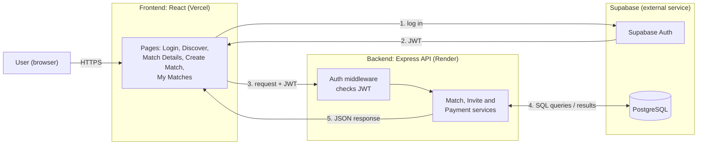

## 0. User Stories and Mockups

### Must Have
1. **Account Creation & Login:** As a new user, I want to create an account and log in, so that I can access the platform features.
2. **Browse & Filter Matches:** As a player, I want to browse available matches and filter them by sport, date, and location, so that I can find a match that fits my schedule.
3. **View Match Details:** As a player, I want to see a match's date, time, location, players, and available spots, so that I can decide whether to join.
4. **Join or Leave a Match:** As a player, I want to join an available match or leave one I joined, so that I can play without organizing a game myself.
5. **Create a Match:** As a match creator, I want to create a match by entering the sport, venue, date, time, and number of players, so that others can join my game.
6. **Cost Splitting:** As a match creator, I want to enter the total match cost and have it split automatically among players, so that each player only pays their fair share.
7. **Payment Status:** As a player, I want to mark my share as paid (simulated payment) and see my status (Paid / Pending), so that I know my spot is confirmed.

### Should Have
8. **Invite Players:** As a match creator, I want to invite players to my match, so that I can fill spots with people I know.
9. **Manage Match:** As a match creator, I want to view players, edit match details, or cancel the match, so that I can handle changes easily.
10. **Track Payments:** As a match creator, I want to see which players have paid, so that I don't have to chase people manually.

### Could Have
11. **Profile Setup:** As a registered player, I want to add my favorite sports, skill level, and a short bio, so that other players know my background.

### Won't Have (this MVP)
- Public challenges
- In-app chat
- AI or personalized recommendations
- Rankings, leaderboards, and points
- Social features (followers, feed)
- Real payment processing (Mada, Apple Pay)

## 1. System Architecture

Below is the high-level architecture of Wesal's MVP and how data moves between each part.

### Components

| Part | Tech | What it does |
|------|------|--------------|
| Frontend | React, hosted on Vercel | All the pages the user sees, sends requests to the backend |
| Backend | Node.js + Express, hosted on Render | Handles matches, invites, cost splitting and payment status |
| Auth | Supabase Auth | Sign up and login, gives the user a JWT |
| Database | PostgreSQL on Supabase | Stores users, matches, participants, invites and payments |

### Data flow

1. The user logs in through Supabase Auth and gets a JWT back.
2. Every request from the frontend to our backend includes that JWT.
3. The auth middleware checks the token before the request reaches any service.
4. The service reads or updates the database.
5. The backend sends the result back as JSON and the page updates.

For example, when a player joins a match, the frontend sends `POST /api/matches/:id/join`. The backend checks there's a free spot, adds the player, recalculates everyone's share of the cost, and returns the updated match.

### Why this setup

We went with React and Node/Express because they're both JavaScript and our team already works with them. PostgreSQL fits our data well, since users, matches and payments all link to each other. Supabase gives us a hosted database and login for free, so we don't have to build authentication ourselves.

The backend is a single Express app instead of separate microservices. With 4 people and 6 weeks, that's much easier to build and test. We kept the match, invite and payment logic in separate modules, so it can be split up later if needed.

We're not using a maps API or a real payment gateway in the MVP. Players filter by city and district, and payments are simulated, as planned in our project charter.
